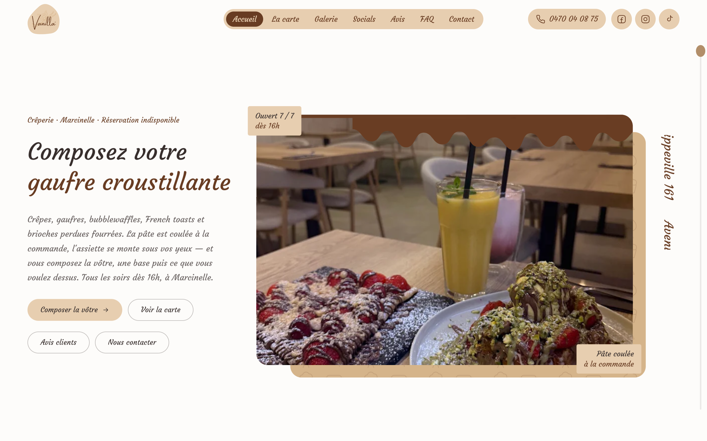
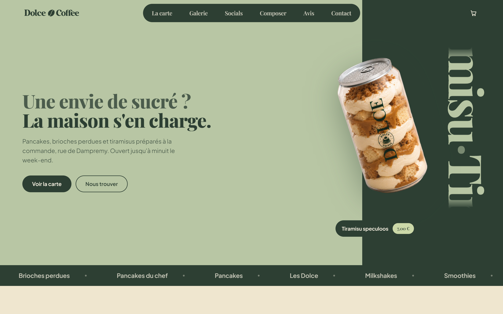

# Core

**Agence digitale — création et refonte de sites web**

Charleroi, Belgique

Nous concevons des sites pour les commerces et les clubs : restaurants, bars,
crêperies, salles de sport, clubs sportifs. Chaque projet est écrit à la main,
sans framework ni générateur — le résultat se charge vite, se référence bien,
et reste modifiable dans dix ans sans dépendre d'un outil qui aura disparu.

Au-delà de la vitrine, nous construisons ce qui fait tourner la maison :
commande à table par QR code, console de cuisine sur tablette, réservation,
billetterie, espace d'administration.

## Compétences

<table>
  <tr>
    <th align="left">Ce que nous maîtrisons</th>
    <th align="left">Ce que nous approfondissons</th>
    <th align="left">Dans les cartons</th>
  </tr>
  <tr valign="top">
    <td>
       
       
       
       
       
       
       
      
    </td>
    <td>
       
       
       
       
      
    </td>
    <td>
       
       
      
    </td>
  </tr>
</table>

Pas de WordPress, pas de constructeur de pages, pas de thème acheté.

## Nos outils

---

## Douze services, quatre temps

<table>
  <tr>
    <th align="left" width="15%">01 — Concevoir</th>
    <td>Sites vitrines · Sites e-commerce · UI / UX Design 
    Poser la structure, l'interface et le discours avant d'écrire la première ligne.</td>
  </tr>
  <tr>
    <th align="left">02 — Développer</th>
    <td>Applications web · Développement sur mesure · Automatisation 
    Commande à table, console de cuisine, réservation, billetterie, administration.</td>
  </tr>
  <tr>
    <th align="left">03 — Faire croître</th>
    <td>Référencement SEO · Optimisation des performances · Intelligence artificielle 
    Être trouvé par ceux qui cherchent déjà ce que vous faites.</td>
  </tr>
  <tr>
    <th align="left">04 — Faire durer</th>
    <td>Maintenance · Hébergement · Accompagnement digital 
    Un site qui ne tombe pas, et quelqu'un qui répond quand il tombe.</td>
  </tr>
</table>

**[Voir les douze services en détail](https://core-agency.be/services/)**

---

## Open source

Sept outils publics, tous écrits selon la même règle : **aucune dépendance,
aucune requête réseau, aucun compte.** Ce sont les instruments que nous
sortons pendant un chantier — un QR code à produire, un contraste à trancher,
une facture à éditer. Ils sont ouverts parce qu'ils servent à d'autres.

Chacun sort d'un besoin réel rencontré chez un client, et chacun porte son
harnais de vérification : **327 contrôles automatisés** au total, rejoués sur
trois versions de Node à chaque modification.

### Core — QR

L'encodeur **ISO/IEC 18004** que nous avons écrit pour le système de commande
à table du Maharaja, ouvert aux quatre niveaux de correction. Lien, Wi-Fi,
contact ; réserve pour un logo **chiffrée en codets détruits contre codets
réparables**, et non à l'estime ; planche d'autocollants numérotés prête à
imprimer. Un décodeur indépendant, écrit pour le harnais, relit chacun des
symboles produits.

[**Essayer la démo**](https://core-agency.github.io/core-qr/) ·
[le code](https://github.com/Core-Agency/core-qr)

 

### Core — SEO

Le titre, la description, les balises de partage et le JSON-LD d'un commerce
belge, avec l'aperçu du résultat Google. Le titre est mesuré **en pixels et
non en caractères**, parce que c'est ainsi que Google coupe. Horaires à deux
services, adresse belge, numéro d'entreprise.

**Cet outil ne produit aucune note ni aucun avis**, et un contrôle automatisé
vérifie qu'il ne peut pas en produire : une note doit venir d'avis réels.

[**Essayer la démo**](https://core-agency.github.io/core-seo/) ·
[le code](https://github.com/Core-Agency/core-seo)

 

### Core — Contraste

Le contraste de deux couleurs selon **WCAG 2.2** et selon **APCA**, sur des
échantillons de texte réels. Quand un duo échoue, l'outil propose la couleur
la plus proche qui passe — en ne déplaçant que la clarté OKLCH, pour que la
teinte de la marque survive. Et une échelle de onze tons depuis une couleur de
marque, chacun annonçant le texte qui se lit dessus.

[**Essayer la démo**](https://core-agency.github.io/core-contraste/) ·
[le code](https://github.com/Core-Agency/core-contraste)

 

### Core — Factures

Générateur de factures et de devis qui tient en trois fichiers. Aucune
dépendance, **aucune requête réseau** : ouvrez la page en mode avion, elle
fonctionne. TVA belge groupée par taux, régime de la franchise, remise
répartie au prorata, export PDF par l'impression du navigateur.

[**Essayer la démo**](https://core-agency.github.io/core-factures/) ·
[le code](https://github.com/Core-Agency/core-factures)

 

### Core — Compression IMG

Redimensionne et convertit les images en WebP, JPEG ou PNG **dans le
navigateur** — aucun téléversement. Les photos qu'un client envoie pèsent
4 Mo pour 3 000 pixels de large ; affichées dans une carte de 400 pixels,
elles coûtent des secondes de chargement pour rien. Sur une image de test :
1,68 Mo ramenés à 87 Ko, soit 95 % de gain.

[**Essayer la démo**](https://core-agency.github.io/core-compression-img/) ·
[le code](https://github.com/Core-Agency/core-compression-img)

 

### Core — Calculs

Les cinq calculs qu'une entreprise belge refait chaque semaine : TVA hors et
toutes taxes, **communication structurée** d'une facture, clé d'un numéro
d'entreprise BCE, contrôle d'IBAN, intérêts de retard. Dix-huit contrôles
automatisés, dont les valeurs de référence publiques.

[**Essayer la démo**](https://core-agency.github.io/core-calculs/) ·
[le code](https://github.com/Core-Agency/core-calculs)

 

### Core — Mentions légales

Mentions légales et politique de confidentialité pour une entreprise belge :
le numéro d'entreprise tient lieu de RPM, la franchise TVA cite l'art. 56*bis*,
la réclamation va à l'Autorité de protection des données. Huit traitements à
cocher, chacun avec sa base légale et sa durée. **Un modèle à faire relire**,
pas un document prêt à publier.

[**Essayer la démo**](https://core-agency.github.io/core-mentions-legales/) ·
[le code](https://github.com/Core-Agency/core-mentions-legales)

---

## Réalisations

### Vanilla Crêperie — Marcinelle

Crêpes, gaufres et brioches perdues composées à la carte. Le site porte un
composeur de commande — une base, puis ce que le client veut dessus — relié à
une console de service sur tablette et à un système de commande par QR code à
table.

**[vanilla-creperie.pages.dev](https://vanilla-creperie.pages.dev)**

 

### Dolce Coffee — Charleroi

Pancakes, brioches perdues et tiramisus préparés à la commande, rue de
Dampremy. Direction artistique matcha et crème, fiches produit indexables,
galerie, et le même socle de commande à table que Vanilla.

**[dolce-coffee.pages.dev](https://dolce-coffee.pages.dev)**

---

## Comment nous travaillons

| | |
|---|---|
| **Écrit à la main** | HTML, CSS et JavaScript. Rien à mettre à jour tous les mois, rien qui casse tout seul. |
| **Rapide par construction** | Des fichiers statiques servis depuis un réseau de diffusion. Pas de base de données à interroger pour afficher une page. |
| **Une direction artistique par projet** | Chaque commerce reçoit son identité : typographies, palette, mise en page. Aucun gabarit réutilisé d'un client à l'autre. |
| **Ce qui suit la vitrine** | Commande par QR code, console tablette, réservation, billetterie, administration. |
| **Protégé** | Filtre anti-aspiration, en-têtes de sécurité, cloisonnement des droits en base. |

---

## Journal

<!-- journal:début -->

| | | |
|---|---|---|
| 11 août 2026 | [`Core-Agency`](https://github.com/Core-Agency/Core-Agency) | [Ajoute les trois nouveaux outils et la carte des douze services](https://github.com/Core-Agency/Core-Agency/commit/29a310fbaa08e96ae360a7f8ebc7b4856d3bade8) |
| 11 août 2026 | [`core-contraste`](https://github.com/Core-Agency/core-contraste) | [Ajoute le badge de verification au README](https://github.com/Core-Agency/core-contraste/commit/847d74e081a19f6567f8dd77ce1f8fa355518a9d) |
| 11 août 2026 | [`core-seo`](https://github.com/Core-Agency/core-seo) | [Ajoute le badge de verification au README](https://github.com/Core-Agency/core-seo/commit/e7269dba773ad600eae50b277e9808ef21673b5d) |
| 11 août 2026 | [`core-qr`](https://github.com/Core-Agency/core-qr) | [Ajoute le badge de verification au README](https://github.com/Core-Agency/core-qr/commit/d0c156b239929fe825a16ca28cb315bf6a375bd7) |
| 11 août 2026 | [`core-contraste`](https://github.com/Core-Agency/core-contraste) | [Fait tourner le harnais sur Node 20, 22 et 24 a chaque poussee](https://github.com/Core-Agency/core-contraste/commit/2e16e94ec812402d017018740894e0bb31914fe0) |
| 11 août 2026 | [`core-seo`](https://github.com/Core-Agency/core-seo) | [Fait tourner le harnais sur Node 20, 22 et 24 a chaque poussee](https://github.com/Core-Agency/core-seo/commit/16a9290550c79236ebf1f333b3b5d6fea8021334) |
| 11 août 2026 | [`core-qr`](https://github.com/Core-Agency/core-qr) | [Fait tourner le harnais sur Node 20, 22 et 24 a chaque poussee](https://github.com/Core-Agency/core-qr/commit/58f80ef8a7bc356b88d7a8d38c599bf91b6e0b90) |
| 11 août 2026 | [`core-contraste`](https://github.com/Core-Agency/core-contraste) | [Core - Contraste : WCAG, APCA, et la couleur la plus proche qui passe](https://github.com/Core-Agency/core-contraste/commit/aaa8f7aead21e2d6e992b7aef9d7fb7a53fa8872) |

Les 8 dernières modifications des dépôts publics. Ce tableau est reconstruit par [`outils/journal.js`](outils/journal.js) et ne change que lorsque le code change.

<!-- journal:fin -->

---

**Un projet ?**

